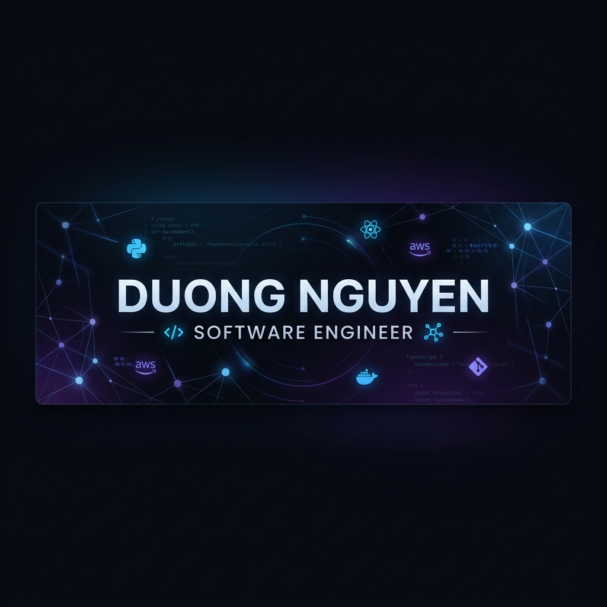

<!-- DUONG NGUYEN GITHUB PROFILE -->

  

<h1 align="center">👋 Hi there, I'm Duong Nguyen!</h1>

  
  
  

## 🚀 About Me
I am a dedicated **Software Engineer** specializing in backend development and cloud architecture. With a strong foundation in **Java Spring Boot**, **Microservices**, and **AWS**, I focus on building scalable, high-performance systems. I am also passionate about exploring **AI integration** in modern web applications.

- 🎓 **Education:** Ho Chi Minh City University of Industry (GPA: 3.22/4.0)
- 💼 **Current Focus:** Microservices Architecture & Cloud-native solutions
- 🛠 **Latest Project:** AI-powered E-commerce Platform
- ✉️ **Contact:** [duongnguyen.work@gmail.com](mailto:duongnguyen.work@gmail.com)

---

## 🛠 My Tech Stack

### 💻 Languages & Core

  

### 🌐 Frameworks & Libraries

  

### 🗄 Databases & Cloud

  

### 🔧 Tools & Others

  

---

## 📊 GitHub Statistics

  <table border="0">
    <tr>
      <td>
        
      </td>
      <td>
        
      </td>
    </tr>
  </table>
   
  

---

## 🏗 Experience Highlight
### **Intern Software Engineer | FPT Software**
*LIMS Project (Microservices Architecture)*
- Designed and implemented scalable backend services using **Spring Boot**.
- Integrated **AWS APIs** for robust cloud communication.
- Optimized query performance using **MongoDB** indexing.
- Collaborated in an Agile team to deliver high-quality code and documentation.

---

  <i>"Transforming complex problems into elegant code."</i>
   
  

